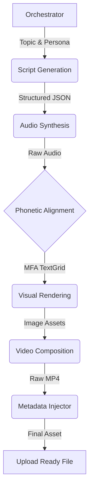

# Thai Short-Form Content Automation Pipeline


An end-to-end **Algorithmic Media Engine** engineered to autonomously produce viral short-form video content tailored for the Thai demographic.

This project is not a simple automation script; it is a **production-grade distributed pipeline** that orchestrates Large Language Models (LLMs), Neural Text-to-Speech, Phonetic Alignment engines, and complex programmatic video compositing. It solves high-barrier engineering challenges regarding **non-Latin script rendering**, **audio signal processing**, and **algorithmic anti-fingerprinting**.

---

## ⚙️ Engineering Challenges & Solutions (Why this matters)

Most automation tools fail when applied to the Thai language due to its unique linguistic properties. This system overcomes those limitations through custom engineering:

### 1. Solving Complex Text Layout (CTL)
*   **The Problem:** Standard renderers (ImageMagick/MoviePy) cannot handle Thai "Vertical Stacking." Vowels and tone marks (e.g., `้`, `ิ`) often float in the wrong positions or overlap consonants.
*   **The Engineering Solution:** Implemented a custom text rasterization engine using **Pillow (PIL)** compiled with **Libraqm** and **HarfBuzz** bindings. This forces OpenType shaping logic to ensure pixel-perfect typography for non-Latin scripts.

### 2. Phonetic Alignment for *Scriptio Continua*
*   **The Problem:** Thai is written without spaces between words. Standard regex splitters cannot synchronize subtitles with audio because they cannot determine word boundaries.
*   **The Engineering Solution:** Integrated the **Montreal Forced Aligner (MFA)**. The pipeline performs forced alignment against a Thai acoustic model to calculate millisecond-accurate timestamps for every phoneme.
*   **Tokenization Logic:** Injected a **Custom Dictionary Trie** into the PyThaiNLP tokenizer to handle "Netizen Slang" (e.g., `แกรร`, `จึ้ง`), preventing alignment crashes on out-of-vocabulary terms.

### 3. Algorithmic Stealth & Metadata Engineering
*   **The Problem:** Social platforms detect and suppress programmatically generated content via perceptual hashing and metadata analysis.
*   **The Engineering Solution:**
    *   **Visual Hashing:** Implemented stochastic video slicing, mirroring, and cropping to alter the perceptual hash of background footage.
    *   **Metadata Spoofing:** A post-processing module injects fabricated **ISO 6709 geolocation tags** (simulating coordinates in Bangkok) and **mobile hardware signatures** (e.g., "Samsung S24 Ultra", "CapCut Android") directly into the MP4 container via FFmpeg bitstream copying.

### 4. Modular Synchronous Pipeline Architecture
*   **The Problem:** Long-running monolithic scripts are fragile and hard to debug.
*   **The Engineering Solution:** Built a **Linear Synchronous Pipeline** using **Dependency Injection** and the **Singleton Configuration Pattern** (via Pydantic). Logic is separated from Content Strategy (YAML recipes), ensuring type safety and modular isolation.

---

## ⚙️ System Architecture

The system follows a modular "Mini-Pipeline" design orchestrated by a central controller.



### The Tech Stack
*   **Language:** Python 3.13 (Optimized for Apple Silicon M3)
*   **Generative AI:** Google Gemini 2.5 Pro (via `google-genai` with Structured Output)
*   **Audio Signal:** Gemini Audio, Edge-tts, FFmpeg (`atempo` Time-Scale Modification)
*   **Alignment:** Montreal Forced Aligner (MFA), PyThaiNLP
*   **Rendering:** MoviePy, Pillow (Libraqm/Fribidi), FFmpeg

---

## 🧩 Modules Overview

| Module | Function | Engineering Highlight |
| :--- | :--- | :--- |
| **Script Gen** | Generates viral narratives. | Uses **Pydantic** to enforce strict JSON schemas, preventing LLM formatting hallucinations. |
| **Audio Gen** | TTS Synthesis. | Uses **FFmpeg `atempo`** to speed up audio (1.3x) without pitch-shifting ("Chipmunk effect"). |
| **MFA Pipeline** | Syncs text to audio. | Wraps a **Conda** environment to run acoustic model alignment subprocesses. |
| **Visual Gen** | Renders subtitles. | Uses **HarfBuzz** shaping engine to fix Thai floating vowel rendering artifacts. |
| **Compositor** | Assembles video. | Implements **Weighted Random Selection** for background footage to maximize asset utility. |
| **Injector** | Spoofs metadata. | Uses `ffmpeg -c copy` to inject data without re-encoding, preserving quality and speed. |

---

## 🛠️ Configuration Strategy

The system separates **Infrastructure** (Secrets) from **Strategy** (Content).

**1. Infrastructure (`.env`)**
API keys and environment flags.

**2. Content Profiles (`config/thai_funny_story.yaml`)**
The "Recipe" for the content. This allows switching personas without changing code.
```yaml
content:
  theme_for_persona: "Thai Gossip"
  language: "Thai"
  
  ...
  
metadata:
  base_latitude: 13.7560  # Bangkok
  android_models:
    - "Samsung Galaxy S24 Ultra"
    - "Google Pixel 8 Pro"

...
```

**3. Singleton Config (`_CONFIG.py`)**
Loads profiles into a strictly typed Pydantic object, ensuring runtime safety.

---

## 💻 Installation & Usage

*Note: This project is optimized for macOS (Apple Silicon) due to specific compiled library requirements for Thai rendering.*

1.  **Prerequisites:**
    *   Python 3.13+
    *   FFmpeg installed system-wide.
    *   `libraqm`, `fribidi`, `harfbuzz` (via Homebrew).
    *   Conda (for the MFA environment).

2.  **Setup:**
    ```bash
    # 1. Install Dependencies
    pip install -r requirements.txt

    # 2. Setup MFA Environment
    conda create -n mfa montreal-forced-aligner
    mfa model download dictionary thai_mfa
    mfa model download acoustic thai_mfa
    ```

3.  **Run:**
    ```bash
    python -m src.short_form_content_pipeline.main
    ```

---

## ⚠️ Context

This project was developed as a technical portfolio piece to demonstrate proficiency in **Systems Architecture**, **Python Automation**, and **AI Integration**. While fully functional as a revenue-generating tool for social media automation, its primary purpose is to showcase the ability to solve complex, niche engineering problems (Linguistic alignment, CTL rendering, and anti-fingerprinting).
